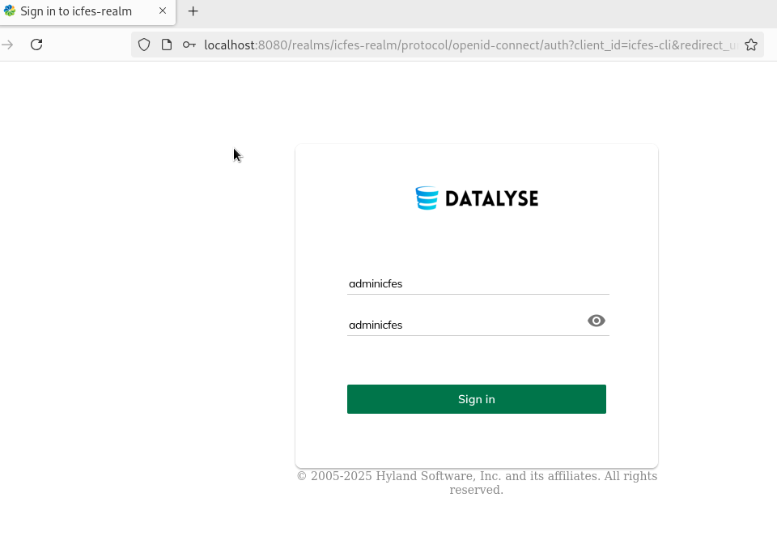
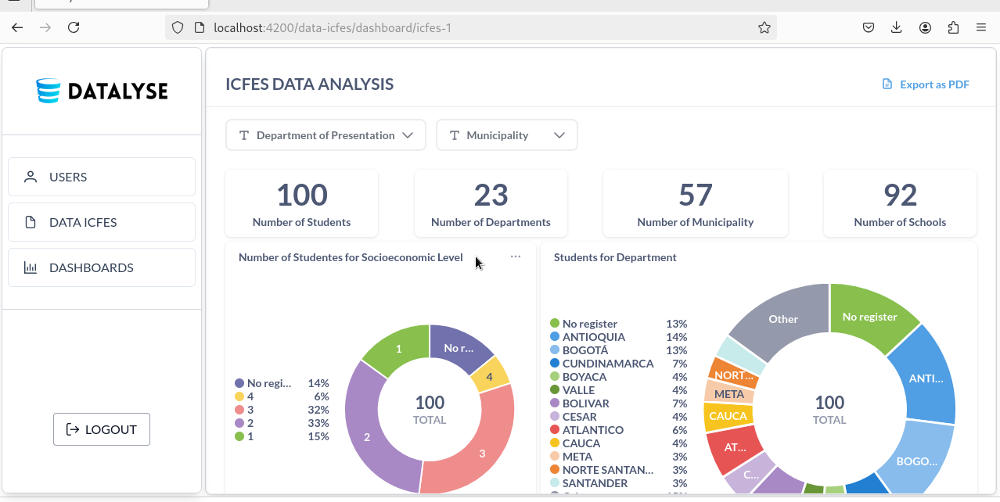
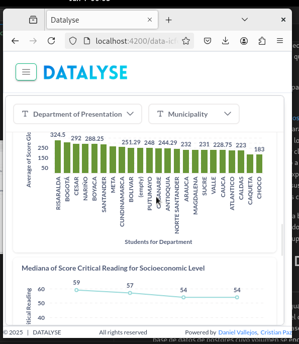
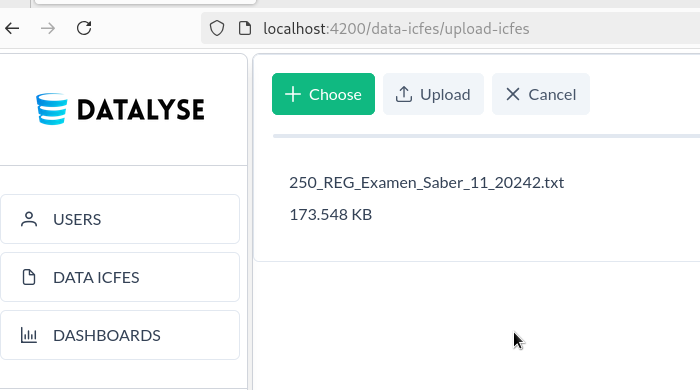
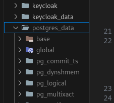
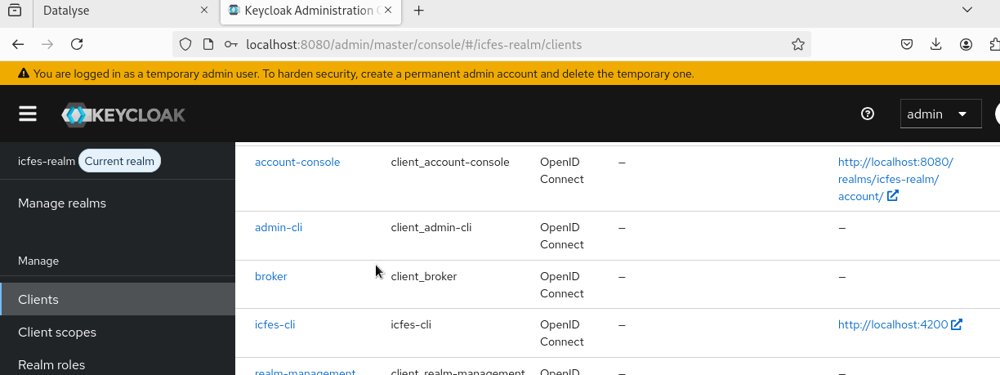
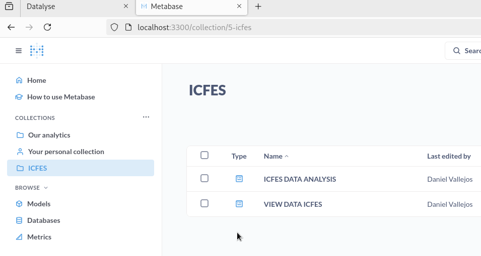

# GENERADOR DE INFORMES ICFES

## Objetivo:
- Ejemplificar el embebido (Embebido estatico metabase) de una herramineta de Inteligencias de negocios en otro sistema cualquiera  

# Desarrollado por:
enlaces github:
- [Daniel Vallejos](https://github.com/danielV277)  
- [Cristian Paz](https://github.com/cp24c)

## Descripcion:
En este proyecto se incorporan dockerizados los siguientes servicios:

- api usando express (backend)
- app-icfes usando angular (frontend)
- postgresdb (base de datos)
- keycloak
- metabase
- pgadmin

Usted puede encotrar las configuraciones de los servios en el archivo docker-compose.yml y si el servicio necesita otras configuraciones en los diferentes Dockerfiles que se referencian en el mismo archivo.

Podra mirar las credenciales administrativas para ingresar a los servicios en el docker-compose.yml

Lo que usted mirar al ingresar al http://localhost:4200 que es la app-icfes levantada, es el login de keycloak para redirigir al sistema.

usted tendra dos usarios con diferentes roles los cuales podra explorar en keycloak en el reino icfes-realm y cliente icfes-cli, al ingresar segun su usuario podra tener acceso a diferentes funciones segun su rol, en cualquier caso usted podra exporar dos paneles de metabase embebidos en el la aplicación con sus configuraciones y podra cerrar sesion y volver a iniciar con otras credenciales.

los elementos imcorporados son responsive

para este ejemplo se usaron datos reales de la base de datos de ICFES, que solo podra subir como administrador, los archivos de prueba los encotrara en en la carpeta public_uploads, si tiene permisos puede importar datos.

# IMPORTANTE ANTES DE EJECUTAR

Las configuraciones de algunos servicios en guardan el volumenes que hacen referencias a carpetas locales, en el caso de los datos de ICFES y los Datos de configuración de Metabase se almacenan en la base de datos de postgres cuyo volumen se encuentra comprimido en el archivo postgres_data.zip si quiere mirar todas con configuraciones realizadas descomprima este archivo y deje la carpeta postgres_data en el directorio raiz.

si usted esta en linux recuerde dar permisos al usuario para poder escribir y leer datos del proyecto
supongamos se usuario es vboxuser entonces ubiquese en la raiz del proyecto despues de haber descomprimido los archivos puede usar el comando: 

sudo chown -R vboxuser:vboxuser .

tambien el punto (.)

# EJECUTAR PROYECTO

Para ejecutar el proyecto recuerde tener instalado doker en su disposivo.

Ubiquese en la carpeta raiz y ejecute

docker-compose up --build

esto empesara a clonar las imagenes que necesite y despues a levantar los contenedores, esto puede tardar un tiempo.

Si al levantar los servios revisa los primeros logs encontra errores de app-icfes, metabase y api, esto es porque los servicios dependen de la base de datos en el servicio db, espere que se creen las  bases de datos, y los servicios pudan conectarse, esto se hace automatico. Las aplicaciones en los contenedores reintentan conectar cada cierto tiempo, en el momento en que se estable la conexión los errores dejaran de aparecer, esto puede tardar un tiempo espere.

Despues de levatados los contenedores usted podra acceder a los servicios. puede entrar al http://localhost:4200 donde se desplegara nuestra aplicación principal.

# CREDENCIALES LOGIN APP-ICFES
- Role administrativo
    - Nombre de usuario: adminicfes
    - Contraseña: adminicfes
- Role usuario con permisos de lectura:
    - Nombre de usuario: user1
    - Contraseña: user1

usted puede gestionar esto ingresando al servicio de keycloak, en el http://localhost:8080

- Credenciales keycloak

    - Nombre usuario: admin
    - Contraseña:  admin

Nota: todos los servicios, puertos y credenciales usted los puede encontrar en el archivo docker-compose.yml

# ADMISTRACION DE METABASE

Usted puede crear, modificar, compartir paneles de metabase ingresando al servicio, para nuestro caso los paneles creados se guardan en la carpeta ICFES.

- Credenciales Metabase

    - Nombre usuario: admin@admin.com
    - Contraseña:  adminpass1

# Conclución

Es es proyecto se ejemplifica la incorporacion estructurada de diferentes aplicaciones usando docker y docker-compose, para la administracion de una aplicacion por roles como la administracion de usuarios se usa keycloak y se incorpora con sus configuraciones tanto en el API como en APP-ICFES, ademas de los paneles de metabase, se usan lo volumnenes para la persistenacia de los datos, y bases de datos y se logra una integracion entre los diferenetes sistemas de una manera correcta. 